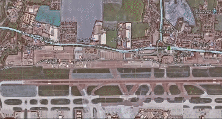
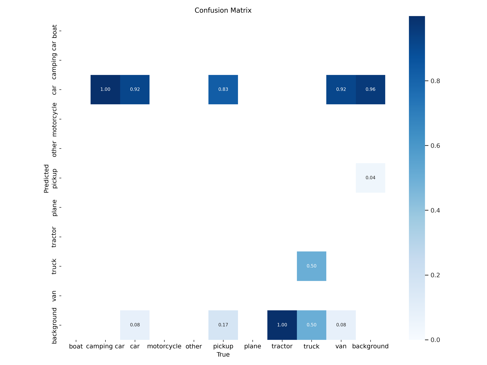
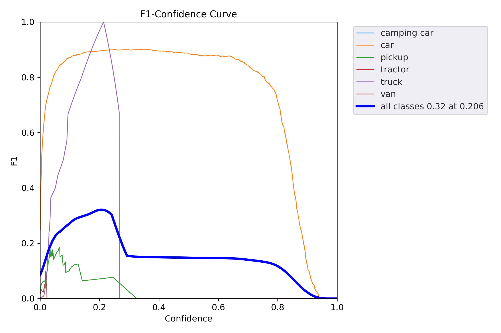
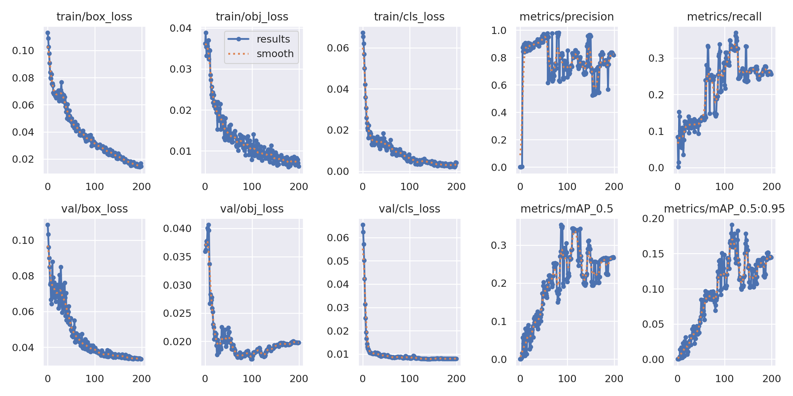

# Aerial Drone Footage Transfer and Military Vehicle Detection

## Overview

This project simulates the transfer of aerial drone footage to a ground unit, which processes the video feed to identify and highlight green vehicles, potentially indicating military vehicles. The project leverages advanced computer vision techniques to perform real-time object detection and colour classification.

The sender component captures video from a camera or video file, encodes it, and transmits the frames to a server. The receiver component processes these frames using a YOLOv5 model for detecting various types of vehicles and a TensorFlow model for classifying their colours. If a green vehicle is detected, it is highlighted and an alert is generated. This setup mimics a practical application where drone footage is analysed on the ground to monitor and identify specific targets, enhancing situational awareness and decision-making in real-time scenarios.

The system also provides various performance metrics and visualisations to evaluate the effectiveness of the detection and classification models.

## Features

- **Real-time Video Streaming**: Captures video from a camera or video file and streams it to a server.
- **Object Detection**: Utilises YOLOv5 for detecting various types of vehicles in the video feed.
- **Color Classification**: Uses a TensorFlow model to classify the colour of detected vehicles, focusing on identifying green vehicles.
- **Alerts and Visualisations**: Highlights identified vehicles and displays alerts for green vehicles, along with various performance metrics.

## Demo


## Getting Started

### Prerequisites

- Python 3.7+
- OpenCV
- NumPy
- PyTorch
- TensorFlow

### Installation

1. Clone the repository:
    ```sh
    git clone https://github.com/yourusername/drone-footage-detection.git
    cd drone-footage-detection
    ```

2. Install the required packages:
    ```sh
    pip install -r requirements.txt
    ```

### Usage

1. **Run the Sender**: Captures video and sends it to the server.
    ```sh
    python src/sender.py
    ```

2. **Run the Receiver**: Processes the received video feed, and performs object detection and color classification.
    ```sh
    python src/receiver.py
    ```

## Detailed Description of Key Components

### Sender Code

**Initialise TCP Socket**: Connects to the server using the specified IP address and port.
```python
s = socket.socket(socket.AF_INET, socket.SOCK_STREAM)
s.connect((server_ip, server_port))
```

**Video Capture**: Captures frames from the webcam.
```python
cap = cv2.VideoCapture(0)

```

**Frame Encoding and Sending**: Encodes the frames as JPEG images and sends them to the server.
```python
result, frame = cv2.imencode('.jpg', frame)
data = pickle.dumps(frame, 0)
s.sendall(struct.pack(">L", len(data)) + data)
```

### Receiver Code
**Initialise TCP Socket**: Binds to the IP address and port and listens for incoming connections.

```python
s = socket.socket(socket.AF_INET, socket.SOCK_STREAM)
s.bind((server_ip, server_port))
s.listen(10)
conn, addr = s.accept()
```

**Load Models**: Loads YOLOv5 for object detection and TensorFlow model for colour classification.
```python
yolo_model = torch.hub.load('C:/Users/sarpa/Desktop/yolov5', 'custom', path='best.pt', source='local')
tf_model = tf.keras.models.load_model('modelEpoch50.h5')

```

**Receive and Process Frames**: Decodes the received frames and processes them for object detection and colour classification.
```python
frame = pickle.loads(frame_data, fix_imports=True, encoding="bytes")
frame = cv2.imdecode(frame, cv2.IMREAD_COLOR)
yolo_results = yolo_model(frame)
```

**Alerts and Visualisation**: Highlights detected vehicles and displays alerts for green vehicles.
```python
cv2.rectangle(frame, (x1, y1), (x2, y2), (0, 255, 0), 2)
cv2.putText(frame, f'{cls_name}, {color_name}', (x1, y1 - 10), cv2.FONT_HERSHEY_SIMPLEX, 0.9, (36, 255, 12), 2)
```

### Performance Metrics
The following metrics illustrate the model's performance and training progress:

**Confusion Matrix**: The confusion matrix shows the performance of the classification model by comparing actual vs. predicted labels. The diagonal elements represent correct classifications, while off-diagonal elements represent misclassification.



**F1-Confidence Curve**:
This curve illustrates the relationship between the F1 score and confidence thresholds. The F1 score is the harmonic mean of precision and recall, providing a single metric that balances both.



**Training Metrics**:
These subplots show the training and validation losses, and metrics such as precision, recall, and mAP (mean Average Precision) over the training epochs. These plots help in diagnosing underfitting or overfitting and in evaluating the model's training progress.



## Contributions

Feel free to open issues or submit pull requests if you have suggestions for improving this project.

## License

This project is licensed under the MIT License.


